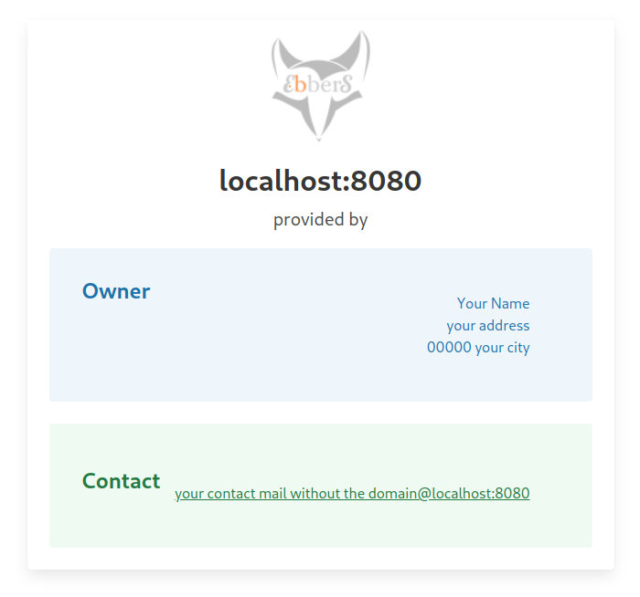

-----

# Go Provider Identification Server

A minimalist, high-performance web server written in Go using `fasthttp`. It's designed to serve a simple provider identification page (like a German "Anbieterkennung"), dynamically populating an HTML template with contact and owner details configured via environment variables.

-----

## Features

  - **High-Performance:** Built with `fasthttp` for speed and low memory usage.
  - **Dynamic Content:** Populates an HTML template with data on each request.
  - **Configuration via Environment:** All customizable data (owner info, contact details, logo) is managed through environment variables, making it perfect for containerized deployments.
  - **Flexible Logo Handling:**
      - Fetches a logo from a remote URL and automatically Base64-encodes it.
      - Uses a local, pre-encoded Base64 file as a fallback or primary option.
      - Includes a built-in 1x1 pixel fallback if the logo fails to load.
  - **Simple & Lightweight:** A single Go file with minimal dependencies.

-----

## Prerequisites

  - [Go](https://go.dev/doc/install) (version 1.18 or newer)
  - An HTML template file located at `public/index.html`.

-----

## Setup & Installation

1.  **Clone the repository** (or save the code as `main.go`).

2.  **Create the required directory and file structure:**

    ```bash
    .
    ├── main.go
    └── public/
        └── index.html
    ```

3.  **Create your HTML Template:**
    Create an `index.html` file inside the `public` directory. This template will be populated with the data from the Go application. See the Example Template section below.

4.  **(Optional) Provide a local fallback logo:**
    If you want to use a local logo, create a file named `b64_logo_128x128` inside the `public` directory. This file should contain the **raw Base64 string** of your logo image, without any `data:image/...` prefix.

    ```bash
    # Example command to generate the Base64 file
    base64 -w 0 your_logo.png > public/b64_logo_128x128
    ```
    If there is no logo and the _DOMAIN_LOGO_ environment variable does not contain a URL, an empty 1x1 square image is used as a placeholder.


-----

## Configuration

The application is configured entirely through environment variables.

| Variable | Required | Description |
| :--- | :--- | :--- |
| `CONTACT_MAIL` | **Yes** | The contact email address to be displayed. Only the part before @ is needed as the rest is attached by the Domain Name|
| `OWNER_NAME` | **Yes** | The full name of the owner or company. |
| `OWNER_STREET` | **Yes** | The street and house number of the owner. |
| `OWNER_ZIP` | **Yes** | The postal code of the owner. |
| `OWNER_PLACE` | **Yes** | The city of the owner. |
| `DOMAIN_LOGO` | No | URL of the logo. If it contains `http`, the server will fetch it. If not set, it falls back to the local `public/b64_logo_128x128` file. |

-----

## Running the Application

1.  **Set the environment variables:**

    ```bash
    export CONTACT_MAIL="webmaster"
    export OWNER_NAME="Max Mustermann"
    export OWNER_STREET="Musterstraße 1"
    export OWNER_ZIP="12345"
    export OWNER_PLACE="Musterstadt"
    export DOMAIN_LOGO="https://example.com/logo.png"
    ```

2.  **Run the server:**
    The server will start and listen on port **80**.

    ```bash
    go run main.go
    ```

    You can now access the page at `http://localhost:80`.

-----

## Default Template

The repository's default template is a minimalistic HTML template that uses Bulma. This design provides users with a clean, simple interface that includes only the necessary information, and its layout is shown below:



-----

## Example Template

Here is a minimal example for `public/index.html` showing how to use the Go template variables.

```html
<!DOCTYPE html>
<html lang="en">
<head>
    <meta charset="UTF-8">
    <meta name="viewport" content="width=device-width, initial-scale=1.0">
    <title>Provider Information for {{.Host}}</title>
    <style>
        body { font-family: sans-serif; line-height: 1.6; max-width: 600px; margin: 2em auto; }
        img { max-width: 128px; height: auto; }
        address { font-style: normal; }
    </style>
</head>
<body>

    

    <h1>Provider Information</h1>
    <p>Information according to § 5 TMG.</p>

    <h2>Owner</h2>
    <address>
        {{.Owner.Name}}<br>
        {{.Owner.Street}}<br>
        {{.Owner.Zip}} {{.Owner.Place}}
    </address>

    <h2>Contact</h2>
    <p>
        Email: <a href="mailto:{{.ContactMail}}">{{.ContactMail}}</a>
    </p>

    <hr>
    <footer>
        <p>This page is served for the host: <strong>{{.Host}}</strong></p>
    </footer>

</body>
</html>
```
-----

## Docker

To configure this service, you'll use the compose.yaml file. This file centrally manages key configurations, including environment variables, network settings, and Traefik labels for routing. The included example compose uses Traefik as an edge proxy, a powerful setup that enables the service to seamlessly handle traffic from multiple hosts and domains.

Use this Traefik label to configure host-based routing. The ``||`` boolean operator allows you to list multiple valid hostnames for a single router.

```yaml
    - "traefik.http.routers.provider-identification.rule=Host(`www.example.com`) || Host(`demo.net`)"

```

This section demonstrates how to use the service in a standalone configuration, without Traefik as an edge proxy.

```yaml
---
services:
  provider-identification:
    image: ebbdev/provider-identification
    # map to the service listening port
    ports:
     - 8080:80
    # this gets parsed into the html
    environment:
      - OWNER_NAME=Your Name
      - OWNER_STREET=your address
      - OWNER_ZIP=00000
      - OWNER_PLACE=your city
      - CONTACT_MAIL=your contact mail without the domain
      - DOMAIN_LOGO="https://picsum.dev/300/200"
    volumes:
      # your custom template
      - ./www/template.html:/public/index.html
      # your logo as base 64 encoded string
      # only used if the env var DOMAIN_LOGO is empty or an invalid URL string
      - ./www/my_base64_image:/public/b64_logo_128x128
```

